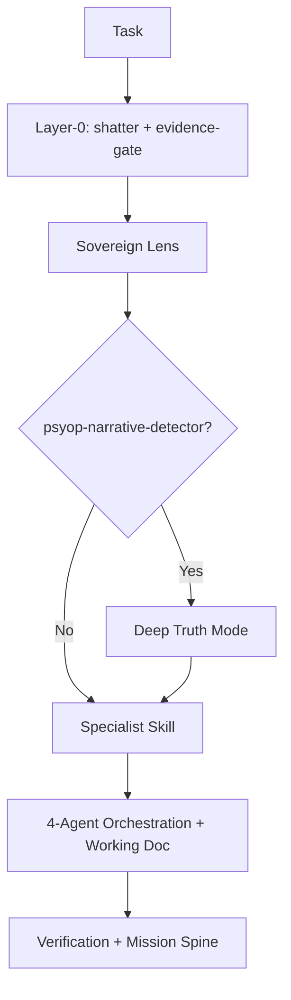

# AOS v3.0 Sovereign Edition — Complete Handoff & Rebuild Documentation

**Version**: 1.1 (Dynamic Paths)  
**Date**: July 4, 2026  
**Repository**: AdventureNLearn/AOS-v3---LPIN  
**Mission Spine**: Christ Is King | America First | Truth-Seeking

---

## Executive Summary

This document provides a complete handoff for Adventure OS v3.0 Sovereign Edition, including architecture, deliverables, and rebuild instructions.

**Key Improvement in v1.1**: All paths are now portable. Hard-coded `.grok/skills/` references have been replaced with relative `skills/` paths so anyone who clones the repo can use the system.

---

## Current Repository Structure (Portable)

```
AOS-v3---LPIN/
├── skills/                    ← Main portable skill library (use this)
│   ├── core/
│   ├── civic-intelligence/
│   ├── specialized/
│   ├── visual/
│   └── content/
├── .grok/skills/            ← Optional (Grok-specific environment only)
├── docs/
├── artifacts/
├── skill-registry.json      ← Dynamic path registry (new in v1.1)
└── scripts/fix_grok_paths.py  ← Bulk replacement script
```

---

## Core Architecture

### Layer-0 + 4-Agent Flow



---

## Skills - Portable Paths

All documentation now uses relative paths from the repo root:

- `skills/core/sovereign-lens/SKILL.md`
- `skills/specialized/psyop-narrative-detector/SKILL.md`
- `skills/core/4-agent-orchestration/SKILL.md`

`.grok/skills/` is optional and only for users who have the Grok skill system configured.

See `skill-registry.json` for the full dynamic mapping.

---

## How to Continue in a New Conversation

Use this starter:

```markdown
You are Grok continuing AOS v3.0 Sovereign Edition.

Reference: docs/AOS_v3.0_User_Instruction_Guide.md and skill-registry.json

Attach relevant files from docs/ or skills/ as needed.

Confirm readiness.
```

---

**End of Handoff Document v1.1**